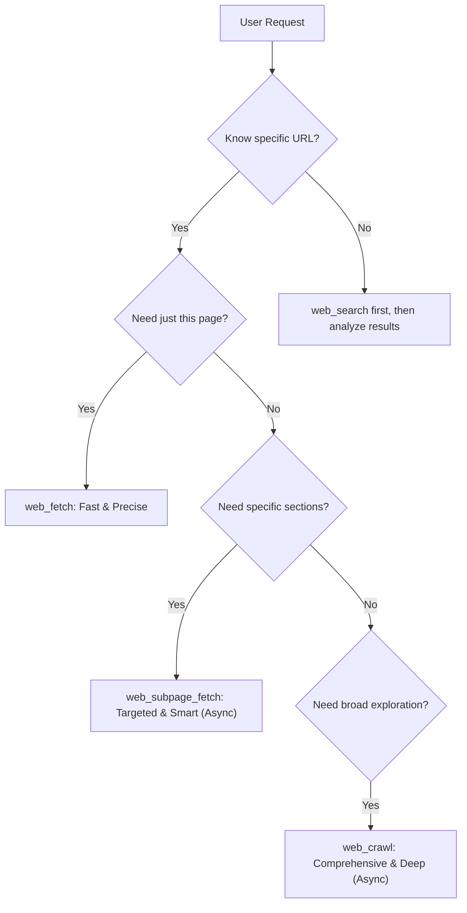

# Web 获取能力与配置

Shannon 提供了一整套全面的 Web 获取工具，旨在以不同深度和精度从 URL 中提取内容。从单页 markdown 提取到整站爬取，这些工具为 agent 的研究能力提供支撑。

## 工具概览

Shannon 针对不同获取需求提供了三种专用工具：

### 1. **web_fetch**（单页面）

对单个 URL 的内容进行精准、快速提取。

* **使用场景**：阅读特定文章、文档页面或新闻条目。
* **能力**：Markdown 转换、元数据提取。
* **最适合**：URL 已知时的定向阅读方法。

### 2. **web_subpage_fetch**（定向多页面）

从某个域名下智能发现并获取相关子页面。

* **使用场景**：公司研究（About、Team、Product）、收集文档章节。
* **机制**：**Map + Scrape**。首先发现所有链接，根据你的查询/目标路径对相关性进行评分，并获取排名前 N 的页面。
* **最适合**：已知域名下需要特定高价值章节的场景（例如，“查找 OpenAI 的 pricing 和 team 信息”）。

### 3. **web_crawl**（深度探索）

递归爬取，从零开始发现结构和内容。

* **使用场景**：审计一个网站、阅读所有博客文章、探索未知域名。
* **机制**：**Firecrawl Crawl API**。自动沿链接导航以查找内容（异步操作）。
* **最适合**：广泛信息收集和“盲式”探索。

#### 相关性评分逻辑（`web_subpage_fetch`）

当从简化后的候选列表中选择要获取的页面时，该工具会基于以下因素计算相关性评分（0.0-1.0）：

1. **路径匹配（高权重）**：与你的 `target_paths` 精确或部分匹配（例如 `/team` 匹配 `/our-team`）。
2. **关键词存在（中等权重）**：URL 中存在标准业务关键词（about、pricing、docs 等）。
3. **URL 深度（低权重）**：优先选择更浅层的 URL（例如 `domain.com/about` > `domain.com/a/b/about`）。
4. **URL 长度（平局打破项）**：更短、更清晰的 URL 会获得轻微加分。

---

## LLM 决策逻辑

LLM 应该如何决定使用哪个工具？



---

## 配置

通过环境变量配置你的首选提供商。

### 主要提供商：Firecrawl（强烈推荐）

Firecrawl 是唯一支持完整工具套件（`web_subpage_fetch` 和 `web_crawl`）的提供商。它提供更好的 markdown 转换能力，并能处理动态 JS 内容。

```bash
export WEB_FETCH_PROVIDER=firecrawl
export FIRECRAWL_API_KEY=your_api_key_here
```

* **获取 API Key**：[firecrawl.dev](https://firecrawl.dev)
* **特性**：Map（链接发现）、Scrape（内容）、Crawl（递归）
* **必需场景**：Deep Research 工作流

### 次级提供商：Exa（回退）

适合语义内容提取，但多页面能力有限。

```bash
export WEB_FETCH_PROVIDER=exa
export EXA_API_KEY=your_api_key_here
```

* **获取 API Key**：[exa.ai](https://exa.ai)
* **限制**：不支持 `web_crawl` 或 `web_subpage_fetch`（Map 模式）。

### 基础提供商：Python（默认回退）

使用标准库（`BeautifulSoup`、`trafilatura`）进行基础静态 HTML 提取。

```bash
export WEB_FETCH_PROVIDER=python
```

* **优点**：免费、快速、不需要 API key。
* **缺点**：无法处理 JavaScript 渲染，没有 Map/Crawl 能力。

---

## 工具使用指南

### 什么时候使用哪个工具？

| 场景                                   | 推荐工具                | 原因                             |
| ------------------------------------ | ------------------- | ------------------------------ |
| "Read this article"                  | `web_fetch`         | 快速、便宜、精准。                      |
| "Research OpenAI's team and pricing" | `web_subpage_fetch` | 智能查找 `/team`、`/pricing` 并获取它们。 |
| "Audit this entire website"          | `web_crawl`         | 无需手动猜测，递归查找所有页面。               |
| "Find all blog posts on this site"   | `web_crawl`         | 非常适合高召回发现。                     |

### 示例用法（面向 Agents）

#### `web_subpage_fetch`

```python
# Researching a company
{
  "url": "https://openai.com",
  "limit": 15,
  "target_paths": ["/about", "/our-team", "/research", "/product"]
}
```

#### `web_crawl`

```python
# Exploring an unknown startup
{
  "url": "https://unknown-startup.com",
  "limit": 20
}
```

### 响应格式

所有获取工具都会返回一个标准化对象：

* `url`：来源 URL
* `title`：页面标题
* `content`：清理后的 markdown 内容
* `pages_fetched`：包含的页面数量（web_fetch 为 1）
* `method`：底层使用的方法（例如 `firecrawl_map_scrape`、`python_requests`）
* `metadata`：附加详情（总爬取数、唯一页面数等）

---

## 性能调优

你可以通过环境变量微调 fetcher 性能：

```bash
# Concurrency for batch scraping (web_subpage_fetch)
# Default: 8
WEB_FETCH_BATCH_CONCURRENCY=8

# Timeout per page scrape (seconds)
# Default: 30
WEB_FETCH_SCRAPE_TIMEOUT=30

# Timeout for Map API discovery (web_subpage_fetch)
# Default: 15
WEB_FETCH_MAP_TIMEOUT=15

# Timeout for crawling (seconds)
# Default: 120
WEB_FETCH_CRAWL_TIMEOUT=120
```

## 故障排查

1. **`web_crawl` 返回 "requires Firecrawl API"**：

   * 确保 `FIRECRAWL_API_KEY` 已在你的 `.env` 中设置。
   * 验证 key 有效并且有 credits。

2. **获取动态站点（React/Vue/Angular）返回空内容**：

   * 切换到 `WEB_FETCH_PROVIDER=firecrawl` 或 `exa`。
   * 默认 `python` 提供商无法执行 JavaScript。

3. **速率限制（429 错误）**：

   * 工具会自动处理重试。
   * 如果频繁出现，请检查你的提供商控制台用量，或降低 `WEB_FETCH_BATCH_CONCURRENCY`。
